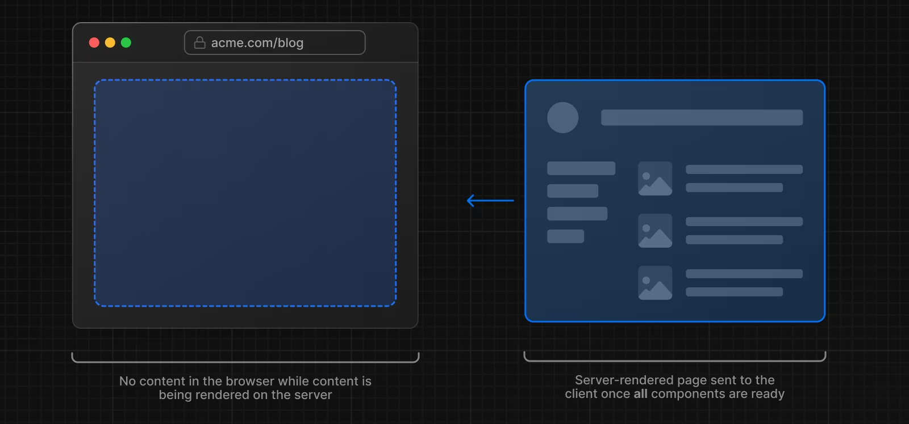
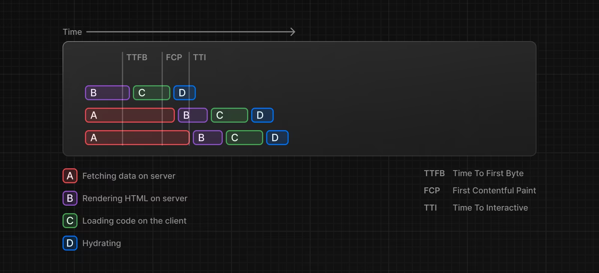

Domain: https://estudy.elearning.engineer/

This is a [Next.js](https://nextjs.org/) project bootstrapped with [`create-next-app`](https://github.com/vercel/next.js/tree/canary/packages/create-next-app).
## Point API
Don't fotgot Header key/value : ContentType : application/json
--------------Register------------
[HttpPost]
https://elearning.engineer/api/Auth_API/Register
[UserEmail,UserPassword] can use UserPhone
--------------Login------------
[HttpPost]
https://elearning.engineer/api/Auth_API/Login
[UserEmail,UserPassword] 
Don't forgot save UserId when got reponse data from login
--------------GetAllUsers------------
[HttpGet]
https://elearning.engineer/api/Auth_API/Get_AllUsers
--------------GetAllCourse------------
[HttpGet]
https://elearning.engineer/api/Courses_API/Get_AllCourses
--------------Order Course [BuyCourse]------------
[HttpPost]
https://elearning.engineer/api/Order_API/Buy_Course
--------------Get UserCourse------------
[HttpGet]
https://elearning.engineer/api/UserCourses_API/Get_AllUserCourses
--------------Buy_Success [Buy_Success]------------
[HttpPost]
https://elearning.engineer/api/Order_API/Buy_Success
[OrderId]
--------------Get Momo QR ------------
[HttpPost]
https://elearning.engineer/api/Momo_Payment
{
  "subPartnerCode": "",
  "requestId": "",
  "amount": ,
  "orderId": "",
  "orderInfo": "",
  "redirectUrl": "",
  "ipnUrl": "",
  "requestType": "",
  "extraData": "",
  "lang": ""
}
## Draw Data Momo
{
  "subPartnerCode": "",
  "requestId": "2323332323331321321",
  "amount": 10000,
  "orderId": "MM15403232433536472575",
  "orderInfo": "YOMOST Sua Chua Uong Bac Ha&Viet Quat 170ml/1 Hop.",
  "redirectUrl": "https://facebook.com",
  "ipnUrl": "https://www.youtube.com",
  "requestType": "captureWallet",
  "extraData": "",
  "lang": "vi"
}

## Getting Started

First, run the development server:

```bash
npm run dev
# or
yarn dev
# or
pnpm dev
# or
bun dev
```

Open [http://localhost:3000](http://localhost:3000) with your browser to see the result.

You can start editing the page by modifying `app/page.tsx`. The page auto-updates as you edit the file.

This project uses [`next/font`](https://nextjs.org/docs/basic-features/font-optimization) to automatically optimize and load Inter, a custom Google Font.

## Learn More

To learn more about Next.js, take a look at the following resources:

- [Next.js Documentation](https://nextjs.org/docs) - learn about Next.js features and API.
- [Learn Next.js](https://nextjs.org/learn) - an interactive Next.js tutorial.

You can check out [the Next.js GitHub repository](https://github.com/vercel/next.js/) - your feedback and contributions are welcome!

## Deploy on Vercel

The easiest way to deploy your Next.js app is to use the [Vercel Platform](https://vercel.com/new?utm_medium=default-template&filter=next.js&utm_source=create-next-app&utm_campaign=create-next-app-readme) from the creators of Next.js.

Check out our [Next.js deployment documentation](https://nextjs.org/docs/deployment) for more details.

# NEXTJS
* https://nextjs.org/
# REACT
* https://vi.legacy.reactjs.org/
* https://react.dev/
# REACT HOOK FORM
* https://react-hook-form.com/
# TAILWINDCSS
* https://tailwindui.com/
# SHADCN UI COMPONENT LIBRARY
* https://ui.shadcn.com/
https://www.youtube.com/watch?v=jdLsQEZ_H4o&list=PL8HkCX2C5h0VGhZnfbwf2hq7yD7nXMbJJ&index=1
# ZOD
* https://zod.dev/
# Convert css -> Tailwind tool
* https://lembdadev.com/tools/tailwind/css-to-tailwind-converter

# Request Api by Axios

# Redux ToolKits-storage-state

https://www.youtube.com/watch?v=ucX2zXAZ1I0&t=1218s
https://www.youtube.com/watch?v=27hMNWcsa-Y
https://www.youtube.com/watch?v=ucdjfU_XKpw&list=PLFfVmM19UNqn1ZIWvxn1artfz-C6dgAFb


# Route Groups: Sử dụng khi bạn muốn tổ chức file mà không ảnh hưởng đến URL.

# Dynamic Routes: Sử dụng khi bạn cần route với tham số động.

# Parallel Routes: Sử dụng khi bạn cần tải nhiều phần giao diện cùng lúc.

# Intercepting Routes: Sử dụng khi bạn cần chặn và xử lý trước khi vào route chính.

